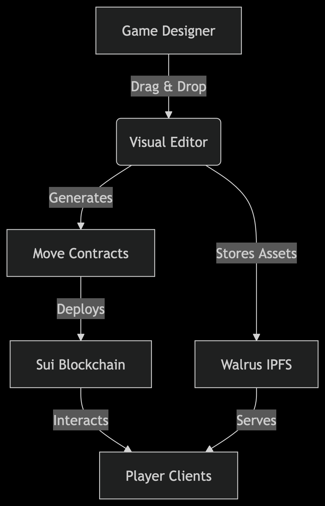
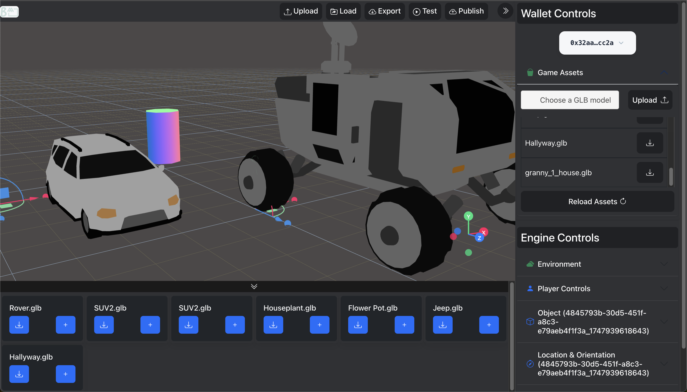
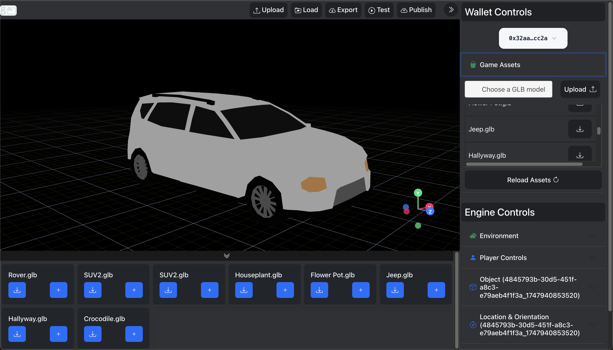
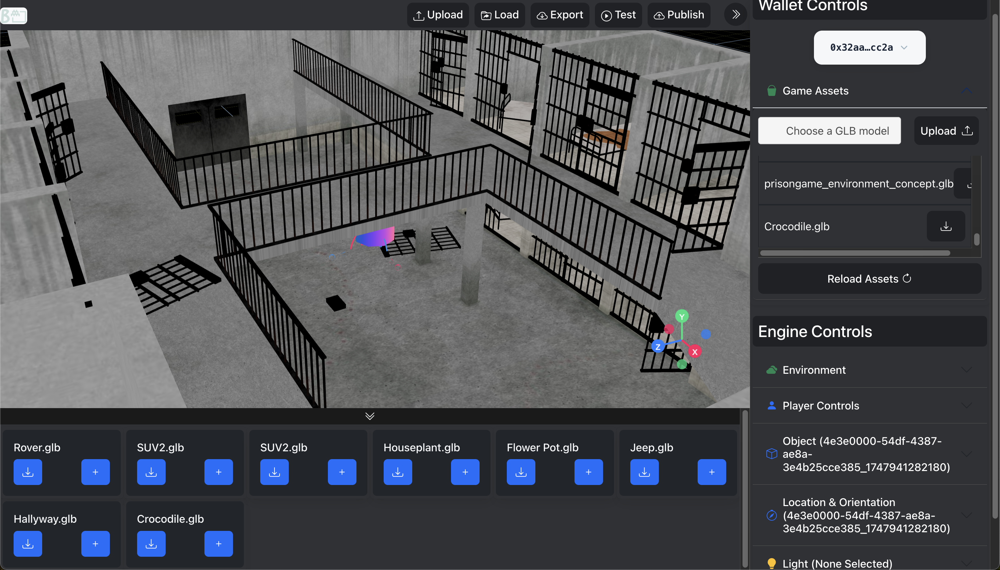
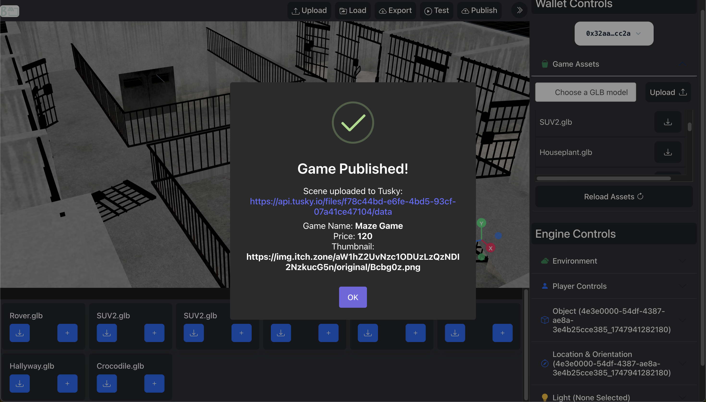
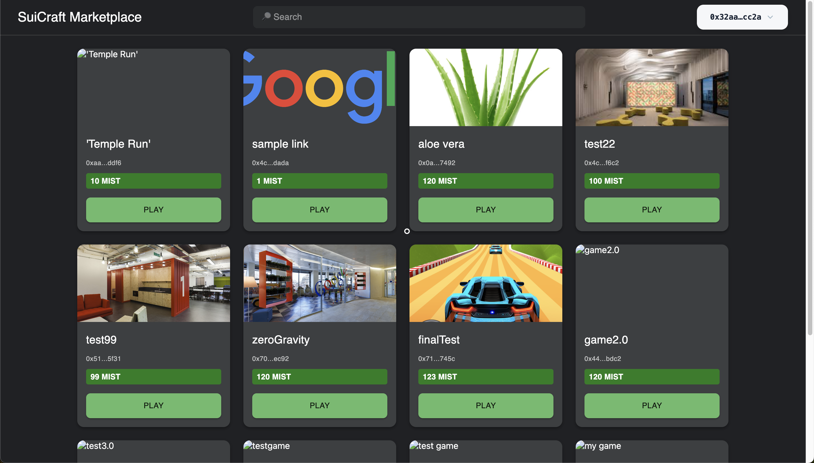
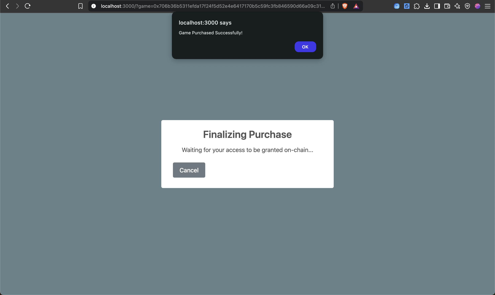
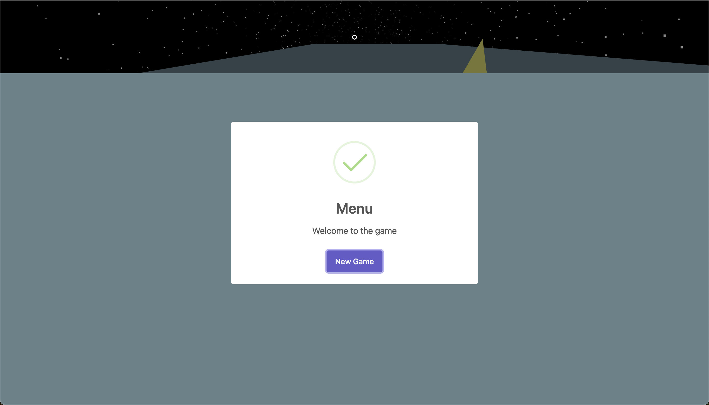
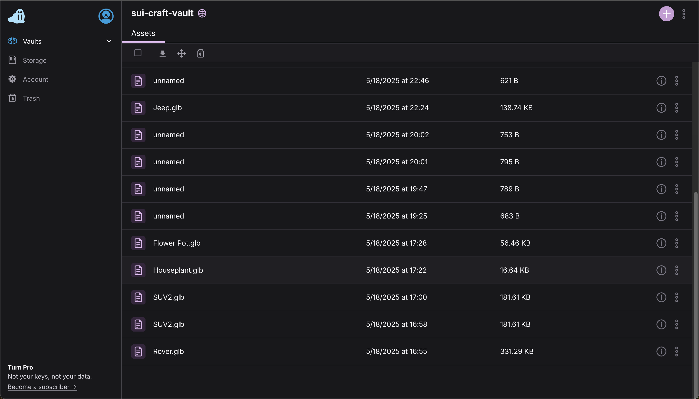

# SuiCraft 🚀


**Revolutionizing Web3 Game Development** - Build, deploy, and monetize immersive blockchain games **without writing code** using Sui's blazing-fast network.

<!-- <div align="center">
  
   
</div> -->

**SuiCraft** revolutionizes on-chain game development by providing a no-code, end-to-end toolchain on the **Sui Blockchain**. Build, deploy, and monetize immersive web3 games with drag-and-drop asset management and Move-based smart contracts—all without writing a single line of code.

---

## 🌟 Why SuiCraft?
### For Developers 🛠️
- 🚀 **10x Faster Development** - Drag-and-drop interface reduces weeks to hours
- 💸 **Built-in Monetization** - Integrated NFT marketplace & in-game purchases
- 🔧 **Visual Contract Studio** - Generate Move contracts from workflow diagrams
- 📦 **Asset Pipeline** - Manage 3D models, audio, and textures with Walrus IPFS

### For Players 🎮
- 🕹️ **AAA-Quality Games** - High-performance Web3 experiences
- 💰 **Play-to-Earn** - Earn NFTs through gameplay achievements
- 🔒 **Provably Fair** - Transparent on-chain game logic
- 🌐 **True Ownership** - Trade game assets on Sui-powered markets


---

## 🛠️ Features at a Glance
| Feature                | Description                                                                 | Tech Used              |
|------------------------|-----------------------------------------------------------------------------|------------------------|
| Visual Game Builder    | Drag-and-drop 3D environment creation with prebuilt assets                  | React-Three-Fiber      |
| Smart Contract  | All gaming logic handled by Move contracts                         | Sui Move |
| Walrus Storage         | Tusky-powered IPFS storage with automatic metadata linking                   | Tusky Protocol         |
| Live Preview           | Test games in real-time with built-in Sui Testnet faucet                   | Vite, Sui DevNet       |


---

## 🔥 Key Highlights

- **No-Code Game Engine**  
  Design gameplay logic, quests, UI flows and in-game purchases via an intuitive visual interface.

- **One-Click Contract Deployment**  
  Mint your game’s Move modules to Sui in seconds—factory contract spins up a new `GameInstance` for you.

- **Walrus Asset Management**  
  Upload and pin 3D models, audio, video and textures through Tusky; assets automatically linked to your on-chain metadata.


---

## 📦 Tech Stack

| Component       | Technology                        |
| --------------- | --------------------------------- |
| Frontend        | React, Vite, Tailwind CSS         |
| Visual Engine   | Three.js, React-Three-Fiber       |
| Blockchain      | Sui Move, @mysten/sui.js          |
| Storage         | Walrus (Tusky)                     |

---

## 🏗️ Live Demos

- **SuiCraft Engine (Game Creator UI):**  
  https://sui-craft-engine.vercel.app

- **SuiCraft Playground (Sample Game):**  
  https://sui-craft-playground.vercel.app

> **Note:** In case the above links are not working, you might have to disable any ad-blocker. If you use Brave Browser, disable the Brave Shields (located on the right end of the search bar).

### 📈 Game-Changing Impact

Empowering Creators

-    90% faster game prototyping vs traditional coding
-    70% cost reduction in smart contract deployment
-    Built-in royalty system (5% platform fee + creator-set %)

Player Benefits

-    True cross-game asset portability via Sui's object ownership
-    Community governance through SUI token voting
-    Verified rarity tracking for all in-game items

---

## 🛠️ Local Development

```bash
git clone https://github.com/S1ddh4rthaG/SuiCraft.git
cd SuiCraft

# Game Engine (Creator UI)
cd game-engine && yarn install && yarn run dev

# Game Store (Player UI)
cd ../interpreter && npm install && npm run start


Environment Variables:
Add VITE_TUSKY_API_KEY=<your_token> in /game-engine/.env
And anywhere else required.
```

### 📷 Screenshots


Game Play:





Game Store:






Tusky:



Don't just play the game, build it. Embrace the power of the SuiCraft and build the future of play!
